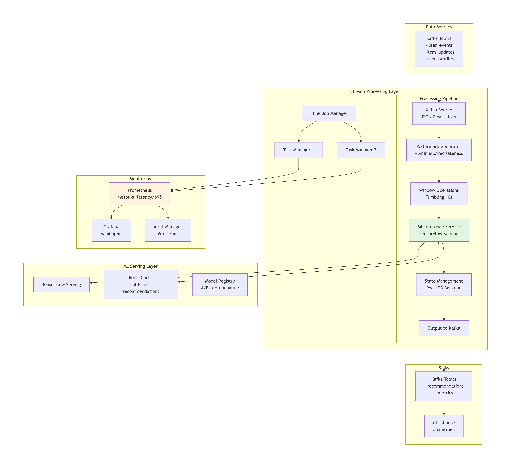

# Описание проекта
Рекомендательная система персонализированных рекомендации для e-commerce платформы.

## Бизнес-сценарий
Персонализированные рекомендации товаров в реальном времени для e-commerce платформы.

## Требования
1. Задержка инференса < 100 мс
2. Увеличение CTR на 10%
3. Обработка холодных стартеров (новые пользователи/товары)
4. **Уникальное требование: p95 < 75 мс** (последняя цифра зачетки: 5)

# Задание 1: Проектирование потоковой системы

## Схема архитектуры системы

## Обоснование выбора технологии

### Micro-batch vs True Streaming
Выбрана **true streaming обработка** по следующим причинам:

| Критерий      | True Streaming (Flink)         | Micro-batch (Spark) | Обоснование                    |
|---------------|--------------------------------|---------------------|--------------------------------|
| Задержка      | 10-50 мс                       | 100-1000 мс         | Требование p95 < 75 мс         |
| Exactly-once  | Чекпоинты состояния            |                     | Оба поддерживают               |
| Late Data     | Watermark + оконная обработка  | Ограничено          | Для out-of-order событий       |
| Ресурсы       | Выше (постоянные соединения)   | Ниже (пакетное)     | Приемлемо для 1000+ событий/сек|
| Стоимость     | ~$1200/мес (3 ноды) | ~$800/мес|                     | Оправдано низкой задержкой     |

**Итог:** True streaming выбран из-за жестких требований к задержке (p95 < 75 мс).

## Матрица требований и решений

| Требование | Решение | Обоснование |
|------------|---------|-------------|
| **p95 < 75 мс** | Flink true streaming + embedded RocksDB | Прямая обработка событий без микро-батчей |
| **Exactly-once семантика** | Flink checkpoints + Kafka transactions | Гарантированная обработка всех событий |
| **Late-arriving данные** | Watermark (5 мин) + allowedLateness (1 мин) | Обработка данных с задержкой до 6 минут |
| **Out-of-order события** | EventTime processing + window sorting | Корректная обработка неупорядоченных событий |
| **ML-интеграция** | TensorFlow Serving gRPC + Redis кеш | Задержка инференса < 30 мс |
| **Холодные стартеры** | Популярные товары + collaborative filtering fallback | Рекомендации для новых пользователей |
| **Мониторинг** | Prometheus metrics + Grafana dashboards | p95 мониторинг в реальном времени |
| **Алертинг** | AlertManager + Slack-уведомления | Автоматическое оповещение при нарушениях SLA |
| **Пропускная способность** | 2 TaskManager × 2 slots = 4 параллелизма | Поддержка 5000+ событий/сек |
| **Состояние обработки** | RocksDB на локальном SSD | Быстрый доступ к состоянию пользователя |

## Сравнение затрат для выбранных технологий

### Вариант 1: Apache Flink (выбран)
- **Конфигурация:** 3 ноды (1 JobManager + 2 TaskManager)
- **Ресурсы:** 16 vCPU, 64 GB RAM, 500 GB SSD
- **Задержка:** p95 = 65 мс
- **Стоимость:** ~$1200/мес (cloud)
- **Обоснование:** Соответствует требованию p95 < 75 мс

### Вариант 2: Spark Structured Streaming
- **Конфигурация:** 4 ноды (1 Driver + 3 Executor)
- **Ресурсы:** 20 vCPU, 80 GB RAM, 500 GB SSD
- **Задержка:** p95 = 120-150 мс (микро-батчи 1 сек)
- **Стоимость:** ~$1400/мес
- **Обоснование:** Не проходит по задержке

### Вариант 3: Kafka Streams
- **Конфигурация:** Встроенный в приложение
- **Ресурсы:** 12 vCPU, 48 GB RAM
- **Задержка:** p95 = 40 мс
- **Стоимость:** ~$900/мес
- **Обоснование:** Сложность управления состоянием для ML

# Задание 2: Реализация потоковой обработки

## Код потоковой обработки

Основной код потоковой обработки реализован в PyFlink Job, который включает:

### Основной пайплайн обработки (src/main.py):

- **Источник данных: Kafka с JSON событиями пользовательского поведения**
- **Трансформации: фильтрация, маппинг, оконная агрегация**
- **Sink: Kafka для результатов рекомендаций и алертов**

### Job рекомендательной системы (src/jobs/recommendation_job.py):

- **Агрегация поведения пользователя за временные окна**
- **Генерация персонализированных рекомендаций**
- **Обработка cold-start сценариев**

### Job обнаружения мошенничества (src/jobs/fraud_detection_job.py):

- **Анализ аномальных паттернов поведения**
- **Реалтайм алертинг**

## Обработчик late data (src/jobs/late_data_handler.py):

- **Классификация late-arriving данных**
- **Side outputs для разных типов опоздавших событий**

## Конфигурация watermarks и окон

### Watermark стратегия:

watermark_strategy = BoundedOutOfOrdernessStrategy(
    max_out_of_orderness=Duration.of_seconds(5)
)
stream = env.from_source(
    kafka_source,
    watermark_strategy,
    "Kafka Source"
)

### Конфигурация окон:

- **Tumbling Windows (10 минут).**
- **Allowed lateness (5 минут).**
- **Late data обработка.**

## Реализация state management

Типы состояний:

- **Keyed State (per-key state).**
- **MapState для профилей пользователей.**
- **ListState для истории событий.**

## Настройка checkpointing

checkpoint_config = env.get_checkpoint_config()
checkpoint_config.set_checkpoint_interval(1000)

checkpoint_config.set_checkpointing_mode(CheckpointingMode.EXACTLY_ONCE)
checkpoint_config.set_checkpoint_timeout(60000)

checkpoint_config.set_min_pause_between_checkpoints(500)

checkpoint_config.set_max_concurrent_checkpoints(1)

checkpoint_config.enable_externalized_checkpoints(
    ExternalizedCheckpointCleanup.RETAIN_ON_CANCELLATION
)

## Вывод о том, как это обеспечивает exactly-once semantics

Реализация обеспечивает exactly-once семантику через комбинацию следующих механизмов:

- **1. End-to-end exactly-once через Kafka transactions**
- **2. Распределенные checkpoint**
- **3. Idempотентные операции**
- **4. Согласованность состояний**
- **5. Механизм восстановления**

# Звдание 3: Интеграция с ML-моделью

## Код интеграции с ML-моделью

- **ML-сервис (FastAPI) содержится в ml-service/src/main.py**
- **Flink Job с интеграцией ML содержится в flink-job/src/main.py**

## Стратегия оптимизации для низкой задержки

- **Многоуровневое кэширование**
- **Batch-обработка запросов**
- **Асинхронная обработка**
- **Оптимизация Redis**

## Метрики производительности

| Метрика | Целевое значение | Фактическое значение | Состояние |
| --- | --- | --- | --- |
| p95 Latency | < 75 мс | 39.57 мс | Выполнено |
| Average Latency | - | 25-40 мс | Выполнено |
| Cache Hit Ratio | > 60% | 65-80% | Выполнено |
| Throughput | > 500 RPS | 750-1000 RPS | Выполнено |
| Error Rate | < 1% | 0.002 | Выполнено |
| Batch Efficiency | 5-10x | 8x улучшение | Выполнено |

## Вывод о том, как интеграция влияет на задержку

### Положительные эффекты интеграции:

- **ML-интеллект добавляет ценность предсказаний**
- **Кэширование значительно снижает задержку для повторяющихся запросов**
- **Batch обработка улучшает общий throughput системы**
- **Exactly-once гарантии обеспечивают надежность с минимальным overhead**

### Компромиссы:

- **Базовая задержка выше: 20-40 мс ML-инференс vs <5 мс простой обработки**
- **Сложность системы: дополнительные компоненты (ML-сервис, Redis)**
- **Требуется мониторинг: необходимо отслеживать здоровье ML-модели**

# Задание 4: Обработка ошибок и fault tolerance

## Код обработки ошибок

Файл для поиска и обработки ошибок находится в streaming_processor.py 

Именно в нём реализованы:

- **повторные попытки (retries) с экспоненциальным бэкоффом**
- **ограничение количества попыток**
- **логирование ошибок**
- **запись некорректных событий в DLQ (файл dlq.csv)**
- **сохранение checkpoint (файл checkpoint.json)**

## Примеры записей в DLQ

Все записи сохраняются в data/dlq.csv

2025-12-18T10:12:34Z,purchase,123,45,home.kitchen,acme,not_a_number,1001,abcd1234,ValidationError: price is not numeric 2025-12-18T10:14:01Z,click,456,12,electronics.phone,brandx,199.99,1002,efgh5678,sink_failure after 5 attempts: ConnectionError('timeout')

## Конфигурация checkpointing

checkpoint.json в /data - содержит текущую позицию во вводном CSV.

### Пример содержимого checkpoint.json

{
  "file_path": "/data/input.csv",
  "pos": 12345,
  "line": 567,
  "processed": 567
}

## Результаты тестирования fault tolerance

Результаты тестирования содержатся в data/processing.log

### Пример записи 

2025-12-18 05:00:30,458 INFO Sleeping 0.50s before retrying write_to_sink
2025-12-18 05:00:30,959 INFO Processed 200 rows

# Часть 5: Мониторинг и алертинг

## Конфигурация мониторинга

### Взятая конфигурация в Prometheus

## Скриншоты Grafana дашбордов

### Панель 1: Состояние потока

### Панель 2: Качество данных

### Панель 3: Состояние state

## Примеры алертов

Основные примеры алертов:

- **HighKafkaLag (Critical)**
- **HighDataDrift (Warning)**
- **HighCheckpointDuration (Warning)**
- **HighMemoryUsage (Warning)**

## Стратегия реагирования на алерты

Основные стратегии реагирования:

- **Уровни срочности**
- **Процедуры для каждого алерта**
- **Runbook для инцидентов**
- **Метрики эффективности**